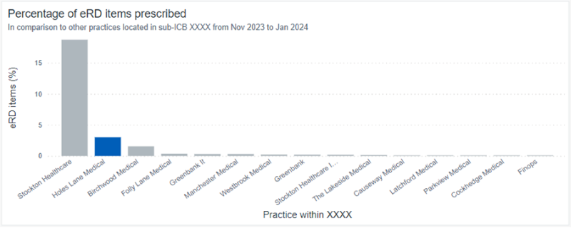


## Importance of decluttering  
  
It’s important to give the user all information necessary, keeping it concise so that it isn’t too distracting. Users can then make effective and informed decisions quickly.   
  
The purpose of decluttering is to:

- save the user time
- provide more time to make meaningful decisions
- provide fewer barriers to using a visualisation
- create less confusion
- create more purposeful chart/focus attention
- help those with sight difficulties  
  
When a user first sees a chart, their focus will be drawn to particular elements. As developers, we need to make sure that the user’s eyes are drawn to the most important elements. 

## How to declutter  
  
You can declutter by:

- removing heavy borders and gridlines 
- removing data markers without a purpose, such as dots on a line chart 
- removing any redundant data, including improving the x and y axis labels to be more concise 
- placing the legend as close to a line chart as possible 
- considering the accuracy needed, for example, would the user need to see each decimal place of a figure, or would rounding a value be more effective? 
- pulling focus toward certain lines or bars by highlighting the most important element, for example, by using NHS Blue (#005EB8) for the one bar you want the user to focus on, and NHS Grey 3 (#AEB7BD) for the other bars in the chart  
  

`#005EB8` is the hex code for NHS Blue (strong blue):  

{{ colorBlock({
    "color": "#005EB8",
    "blockSize": "l"})
}}

`#AEB7BD` is the hex code for NHS Grey 3 (greyish blue):  

{{ colorBlock({
    "color": "#AEB7BD",
    "blockSize": "l"})
}}
  
For more information, you can read a [blog about eliminating clutter on the Storytelling with Data website][declutter 1].
  
## Importance of pulling focus  
  
Using methods to focus the user’s attention is a quick way of making sure the user gets the maximum value possible from the data.  
  
## How to pull focus  
  
You can pull focus by:

- [using visual encoding](../encoding/viz-encoding/), such as size and shape to highlight any necessary items
- [using colour](../colour/) and width, for example, where you need to pull focus toward a specific variable in a line chart, use a thicker NHS Blue (#005EB8) line, with the other lines set as NHS Grey 3 (#AEB7BD)
- using markers or event lines to highlight certain values, or important and influencing aspects, for example, adding a faded section in NHS Grey 4 (#D8DDE0) to denote forecasting, or adding a label to an individual value at a point in time  

`#AEB7BD` is the hex code for NHS Grey 3 (greyish blue):  

{{ colorBlock({
    "color": "#AEB7BD",
    "blockSize": "l"})
}}

`#005EB8` is the hex code for NHS Blue (strong blue):  

{{ colorBlock({
    "color": "#005EB8",
    "blockSize": "l"})
}}

`#D8DDE0` is the hex code for NHS Grey 4 (light greyish blue):  

{{ colorBlock({
    "color": "#D8DDE0",
    "blockSize": "l"})
}}
  
For more information, you can read a [blog focusing on tips for better graphs on the Storytelling with Data website][declutter 2].

[declutter 1]: https://www.storytellingwithdata.com/blog/what-clutter-can-we-eliminate
[declutter 2]: https://www.storytellingwithdata.com/blog/two-tips-for-better-graphs