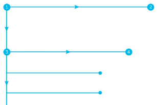
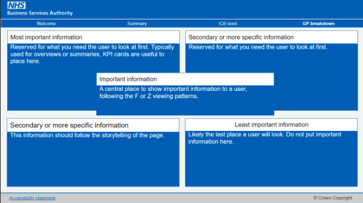
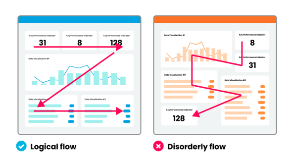
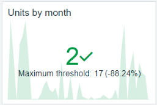
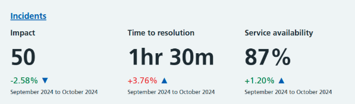
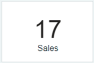


## Layout  
  
KPI cards are the most important measures to show a user user about progress towards specific business objectives. They should be placed in the top left-hand corner of a page and, if necessary, span the top of a page.  
  
Users typically start at the top left-hand corner of a page, scan horizontally, and then work down the page. They continue to scan horizontally from left to right in an ‘F’ pattern until they find something of interest.

Pages can also be formatted using a ‘Z’ pattern. Users, scanning horizontally from left to right, then pause at the centre of the page, before again scanning from left to right. This follows a similar concept as an F pattern but requires fewer eye movements. The location of important content on a page should follow this pattern.

The most important information should be placed at the top left of the page, with other important informationin the centre of the page. Secondary or more detailed information should be in the top right and bottom left of the page, with the least important information in the bottom right.
  
  
  
Ensure your visuals are thoughtfully chosen and provide a concise and meaningful message. This will give a logical flow to the page and improve the user journey.  
A logical flow follows the 'F' or 'Z' pattern. A choice of layout that promotes any other pattern encourages a disorderly flow.  
  
  
  
Using no more than four KPI cards on a page is advisable, so as not to distract and confuse a user.  
KPI cards on a page should be thoughtfully chosen to highlight key takeaways to a user and support the page's storytelling.  
  
For more information, see these [easy dashboard design tips][https://www.seerinteractive.com/insights/3-easy-dashboard-design-tips] from Seer Interactive.  
  
## Best practice  
  
It's important that the format of a KPI card is clear and concise. Give the user only the minimum amount of information necessary to understand the card.  
  
When developing KPI cards, you should:

- be descriptive in what the KPI card shows, it should complement the context of the report page 
- not use ‘Count’ or ‘Sum’ if possible 
- consider how precise data needs to be as users may not need to see ‘12,234.56 prescriptions’, if ’over 12,000 prescriptions’ is appropriate
- avoid abbreviations, for example use ‘Last 12 months instead’ of ‘L12M’, or ‘This month’ instead of ‘MTD’ 
- make sure the date range and any filters are clear to the user, including if filters do not affect the KPI card  
  
Details of date ranges or filters should not be specified on the card itself. This detail should be made clear to a user on the dashboard.  
  
KPI cards should give context or show the user a key point. For example, if the KPI card states ’over 12,000 prescriptions’, the user may want to know if the number of prescriptions has increased for an integrated care board (ICB), and what the trend is.  
Include information to ensure the KPI card is meaningful to a user. In this example, the use of a trend, colour, context and symbol can be used to inform the user that the monthly unit amount is under the maximum threshold.  
  
  
  
KPI cards that use the NHS toolkit should be clear to the user, with the main value in the largest font and trend values shown in a smaller font, accompanied by a symbol and an appropriate colour.  
When a card has a title, this should be placed in the top left of the card.  
Any additional context, such as trend or time period information, should be at the bottom of the card.
  
  
  
## Format  
  
Callout values and labels should always be centrally aligned. If a title is included, this should be left aligned and located in the top left corner.  
  
The callout value should be the largest font size as it is the most important value (in Power BI font size 36 is used).  

  
  
Use the font colour NHS Dark Grey #425563 unless you are using conditional formatting to indicate performance.  
  
 {{ colorBlock({
    "color": "#425563",
    "blockSize": "l"})
}} 
    
The label should support and provide information about the callout value. Use the font size 12 and font colour NHS Black #231F20.  
  
{{ colorBlock({
    "color": "#231F20",
    "blockSize": "l"})
}}
