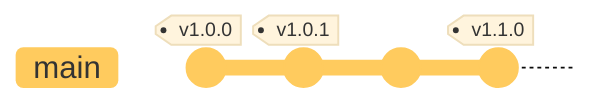
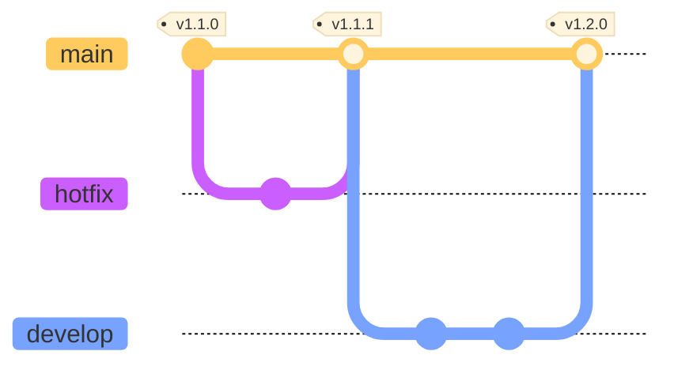
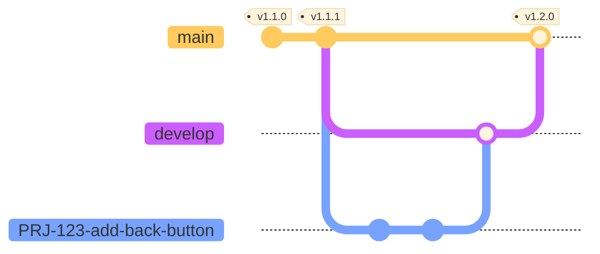
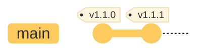
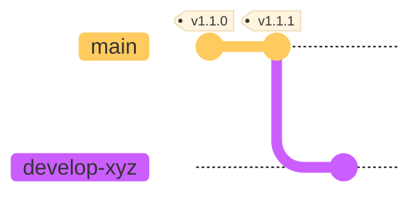
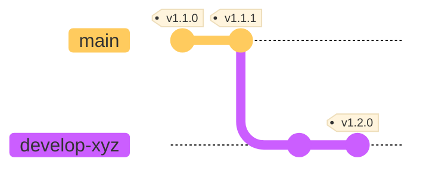
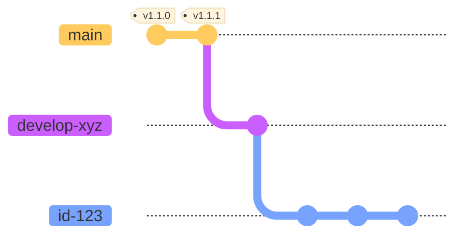
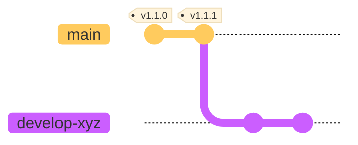

Our standard branching strategy is based on traditional Git-flow and defines three types of branch:

* __Production__
* __Release candidate__
* __Change candidate__

### Production

The `main` branch must contain the exact same code as production. It is created at the start of a project and is maintained throughout the development process. When a change has been deployed to production successfully the branch of code will be merged back into `main`.

* The head of `main` should be git tagged with a semantic version number, indicating the current version of production software.
* Code must not be pushed directly to `main`. Use branch protection to prevent anyone (including maintainers) from pushing to `main`.
* Code must not be merged into main if it has diverged. Configure your project's merge settings to `ff-only` to enforce this behaviour.

### Release candidate

A release candidate branch will hold code intended for release into production. Quality controls such as automated acceptance tests must succeed before a release candidate is accepted into production.

We use these branch names for release candidates:

* `develop`
  For newly developed features and low priority bugfixes
* `hotfix`
  For urgent fixes to address defects found in production

Projects teams should adopt a naming convention to convey additional information, such as the candidate release number and/or a succint descriptive name.

e.g. `develop-wcag22`

* Changes must not be pushed directly to release candidate branches. Use branch protection to prevent contributors from pushing.
* Rebased code may be force pushed by Maintainers only when aligning divergent production code (see [rebasing](../dev-git/#rebasing)). Rebasing a protected branch will require temporary change of push rules.

### Change candidate

A change candidate branch is the most common type of branch, used by developers to iterate their change, before [review](../coding-peer-review/) and merge into a release candidate branch.

Change candidate branch names follow our [naming conventions](../coding-naming-conventions/) to include change ID and description:

* `{change ID}-{brief description}`

e.g. `PRJ-123-add-back-button`

## Workflow

### Preconditions

* A new repository must use `main` as the production branch
* Imported repositories:
  * may have adopted the non-standard `master` branch. This should be changed to `main`
  * must import into an empty repository in the Git hosting provider. Merging a repository into a pre-existing `main` will cause confusion in the git history

### Release Candidate

* Maintainer creates a new release candidate branch `develop-xyz` from `main`

* Changes are developed, see [change candidate](#change-candidate) below
* When the changes are fully tested and ready to go into production, a semver tag is created on the `develop-xyz` branch

* CI/CD triggers to deploy to pre-prod environments and ultimately production
* On successful deployment to production, the branch is merged into `main`. Merge into `main` must be `ff-only`

* Any concurrent release candidate branches should rebase to `main`
  Any of their downstream change candidate branches should rebase to the new change candidate

### Change Candidate

* Developer creates a new change candidate branch, `id-123` branch from the newly created `develop-xyz` branch

* When the feature changes are complete they raise a merge request for [review](../coding-peer-review/)
* The changes are merged (ideally [commits squashed](../dev-git/#squashing)) in to the `develop` branch. The change candidate branch should be deleted

* The _change candidate_ -> _release candidate_ cycle is repeated until all the changes relating to the release are stable and tested
