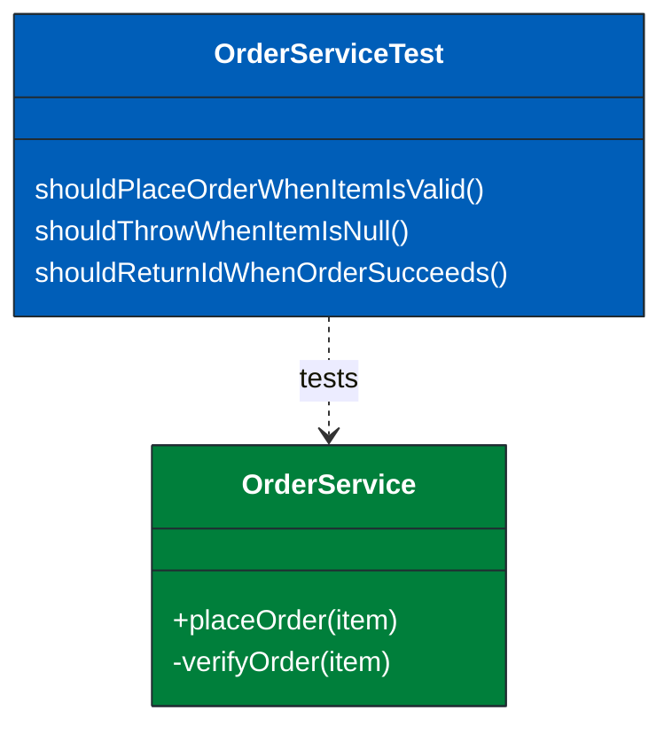
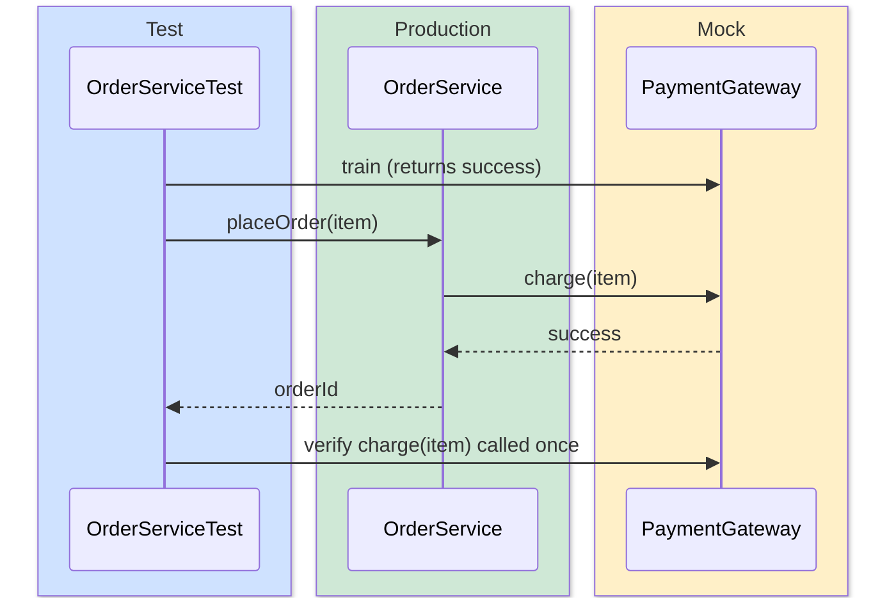
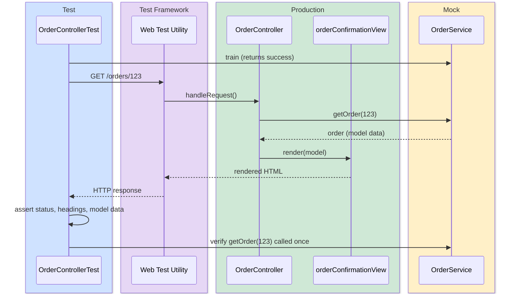
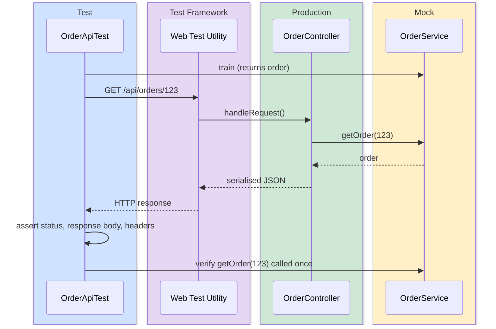
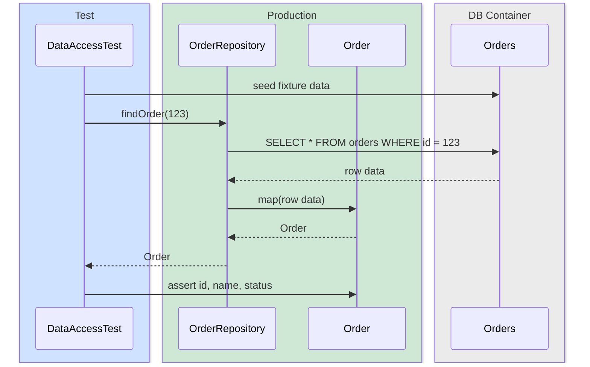
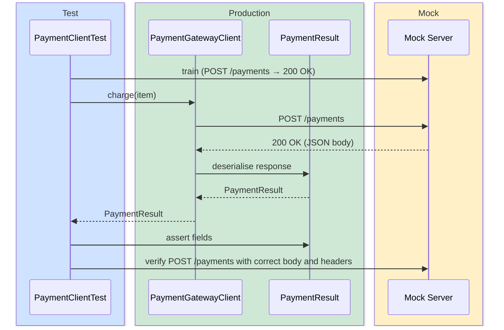
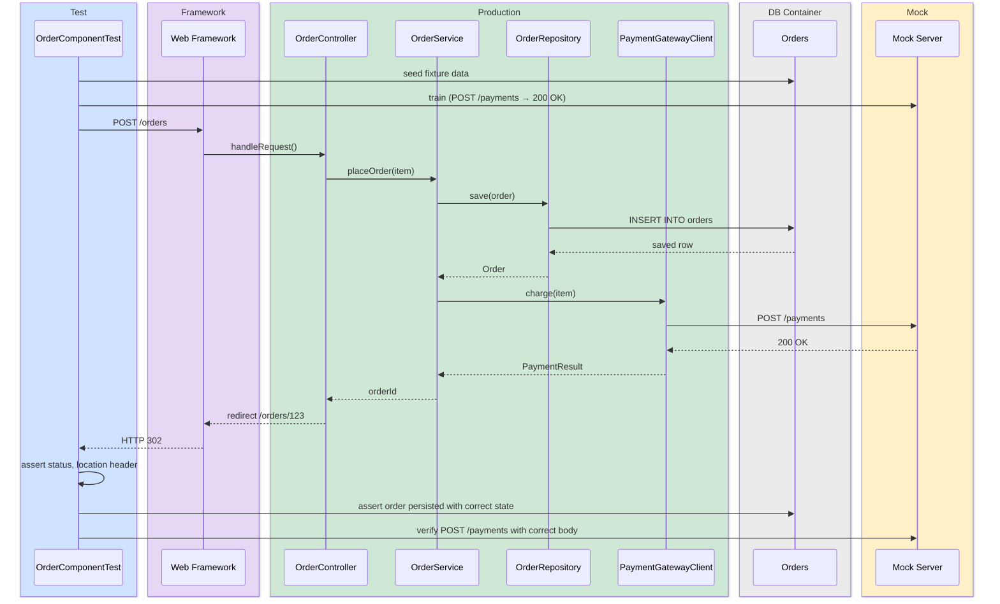

This article defines the test types developers must write, the coverage standards they must meet, and the infrastructure patterns for connecting tests to external resources. For guidance on Test Driven Development and writing good quality tests, see [writing clean tests](../dev-tests-coding/).

## Test scope for developers

Developers are responsible for testing the code they write. We require two types of test:

* __Unit test__
  A self-contained test for a unit of functionality. A unit is the smallest amount of code exposed by a module's public interface, _that can be tested in isolation_.
* __Component test__
  A test for a full-stack, deployable component. The interactions between all modules within a component should be tested as an integrated whole.

Unit tests are fast and focused — they verify individual modules work correctly in isolation. Unit tests form the bottom of the test pyramid, aiming to cover the full range of execution branches in highly controlled and isolated conditions.

Component tests are broader — they verify that modules work correctly together as a deployed whole. Component tests sit above unit tests in the test pyramid, with fewer permutations tested but focussing on interactions. Unlike unit tests, no module within the component is mocked — all internal implementations are real.

## Build environment

Unit and Component tests run in a build environment, either on a local workstation or a Continuous Integration (CI) server. Code is not deployed into a pre-production environment as Testers use, but executes within a test runner. The test runner provides an isolated runtime restricted to the code under test.

* **Local development**
  Developers run the full test suite locally before pushing code. Tests must complete quickly enough that running them locally is not a burden. Slow tests discourage frequent runs, which undermines the fast feedback that testing provides.

* **Continuous Integration**
  The CI server provides a clean, reproducible environment for each build. Failed tests must prevent code propagating to the next step along the route to live.

Environments should be as equivalent as possible along the entire route to live — from a developer's local workstation, through the CI build, into pre-production environments (dev, test, and staging), and finally to production. Differences between environments are a source of bugs that only appear late in the pipeline, where they are more costly to diagnose and fix.

## Test coverage

All unit tests must meet a minimum coverage threshold of **80% line** and **80% branch** coverage. These thresholds must be enforced in the build pipeline so that a build fails if coverage drops below the standard.

Coverage must be measured against production code only. Test code, generated code, and framework boilerplate should be excluded from coverage reports.

Coverage metrics are an indicator, not a guarantee of quality tests. Focus on writing meaningful tests that verify behaviour — coverage is a safety net to identify untested code paths, not a metric to game.

For guidance on writing good quality tests, refer to [writing clean tests](../dev-tests-coding/).

## Integration strategies

Unit and component tests may need to interact with external resources — databases, HTTP APIs, message queues, and cloud services. These must never connect to an externally managed resource such as pre-production environments. Instead, substitute each resource with a test controlled equivalent appropriate to its type:

* **Like-for-like containers** — run the actual technology in a Docker container for resources where behavioural fidelity matters, such as databases and message brokers. Use [Testcontainers](https://testcontainers.com/) to manage container lifecycle within the test suite. In Java, combine with `@DataJpaTest` to slice the Spring context for unit tests against databases.
* **Mock servers** — substitute downstream HTTP APIs with a mock server trained to return specific responses and error conditions. For component tests, use [WireMock](https://wiremock.org/) standalone via Testcontainers — it works with any language and supports OpenAPI stub generation. For unit tests, prefer a lightweight in-process alternative: [fetch-mock](https://www.wheresrhys.co.uk/fetch-mock/) (Node.js) or [responses](https://github.com/getsentry/responses) (Python).
* **Cloud native replicas** — use [Floci](https://floci.io/) to provide local equivalents of AWS services (S3, SQS, DynamoDB, Lambda, and others). Floci is a drop-in replacement for LocalStack running on the same port with no auth token required. Testcontainers provides a `LocalStackContainer` module that is compatible with Floci. Configure the AWS SDK to point at the Floci endpoint rather than real AWS.

## Unit testing scope

Unit tests should isolate the functionality under test to the smallest possible scope. However, sometimes it is not possible or advisable to test in complete isolation.

### Modular tests

Most languages support modularisation and encapsulation, allowing collections of methods and data to be treated as a unit: An object-oriented class or a file with public functions. In either case, unit tests should target the public interface only. Encapsulated, private implementation methods should not be tested directly.

`OrderServiceTest` targets the public interface of `OrderService`. Each test method names the behaviour it verifies. The production class has no knowledge of the test class.

### Mocking

To isolate testing to a unit, downstream dependencies may be mocked. Mocking frameworks support:
* **substitution** - a mock will act in place of a dependency
* **training** - a mock can behave as directed by the test and make appropriate responses
* **verification** - actual inputs into mocks are verified against expected values

Mocking frameworks are available as language specific libraries for mocking modules, or as standalone services for external, downstream APIs.

The test trains the mock before exercising `OrderService`. The production class calls the mock as part of its normal logic — it has no knowledge it is being tested. After the call, the test verifies the mock received the expected inputs, confirming the production class behaved correctly.

### Web layer unit tests

The web layer or Model, View, Controller (MVC) of a user interface should be tested as a whole. Use frameworks such as Spring MvcTest or Supertest to send a crafted request to a URL and validate the response. The test should invoke the responsible controller and assert on the rendered view. Services below the controller are outside the scope of an MVC unit test and should be mocked. Assertions should be made on mocks _and_ the rendered view. Verifying views at a unit level can save time and effort as they can cover multiple permutations without the overhead of the full environment in an acceptance test.

The test drives the full MVC stack through the framework — the controller, model, and view all execute as normal. Only the downstream service is replaced with a mock. After the response is returned, the test asserts on both the rendered view and the mock, confirming that the correct data was fetched and correctly rendered.

Assert on:

* **HTTP status code** — correct status for each scenario (200, 302, 400, 404, etc.)
* **Semantic and accessible HTML** — page structure supports accessible navigation; every form input has an associated `<label>`; error messages are linked to their input via `aria-describedby`
* **Page information** — correct page title, heading, and any breadcrumbs or navigation
* **Model data rendered** — values from the model appear in the correct locations in the view
* **Conditional content** — content that shows or hides based on model state renders correctly for each condition
* **Form pre-population** — form fields are pre-populated with model values on re-display after a validation failure
* **Validation errors** — every potential error displays a message appear against the relevant field, and an error summary is rendered at the top of the page
* **Links and redirects** — links point to the correct URLs; successful form submissions redirect to the expected destination
* **Security headers** — required headers are present and aligned to our standards; see [Security headers](../../security/security-headers/) and [Content Security Policy](../../security/content-security-policy/)

### API layer unit tests

The API layer should be tested using the same approach as web layer tests. Send a crafted HTTP request and assert on the response. Services below the controller should be mocked.

The test drives the full API stack through the framework — the controller executes as normal. Only the downstream service is replaced with a mock. After the response is returned, the test asserts on both the HTTP response and the mock, confirming that the correct data was fetched and correctly serialised.

Assert on:

* **HTTP status code** — correct status for success and each error case
* **Response body** — correct fields, values, and data types in the serialised response
* **Error responses** — correct error structure and message for each failure scenario
* **Content-Type header** — response is serialised in the expected format (e.g. `application/json`)
* **Authentication behaviour** — unauthenticated requests return `401`; requests without the required permissions return `403`
* **Security headers** — required headers are present and aligned to our standards; see [Security headers](../../security/security-headers/)

### Data access layer tests

The data access layer must be tested against a production-like database running in a Docker container. There is no value in testing production queries against a mock database interface. Using a non-production in-memory equivalent such as H2 risks inconsistent responses. Docker databases that are equivalent to production, with liquibase controlled schemas provide an ideal solution to test data access entities and queries.

The test owns the fixture data — it seeds known rows before each scenario. The repository and entity execute as normal against a real database schema. There is no mocking; the test validates the full data access path including SQL, ORM mapping, and entity field values.

Assert on:

* **Entity mapping** — ORM entities map correctly to the schema (column names, types, relationships and constraints)
* **Query results** — custom queries return the expected records for each scenario
* **Filtering** — `WHERE` clauses return only matching records; provide fixture data that should *not* appear to confirm correct filtering
* **Joins** — joined queries return the correct combined data; provide fixture data for unmatched rows in related tables to guard against missing join conditions
* **Ordering** — queries with ordering return records in the expected sequence
* **Aggregation** — aggregate queries (`COUNT`, `SUM`, `AVG`, etc.) return the correct computed value across the fixture data
* **Empty results** — queries return an empty result rather than an error when no records match
* **Write operations** — inserts, updates, and deletes produce the expected state in the database

### API client tests

An API client module encapsulates calls to a downstream service. Test against a mock object or mock server trained to return controlled responses. Where possible, construct the mock from a contract specification (such as [OpenAPI](https://spec.openapis.org/oas/latest.html)) to validate that the client conforms to the contract.

The test trains the mock server before invoking the client. The client sends a real HTTP request to the mock server — it has no knowledge it is being tested. After the call, the test asserts on the returned domain object and verifies the mock received the correct request, confirming that the client serialises and deserialises correctly and sends the expected headers and body.

Assert on:

* **Request structure** — the client sends the correct HTTP method, URL path, query parameters, and request body
* **Authentication headers** — the client includes the required credentials (e.g. `Authorization: Bearer <token>`, API key headers)
* **Successful response** — the client correctly deserialises a `2xx` response and returns the expected data structure
* **Error responses** — the client handles each expected HTTP error status (`400`, `401`, `403`, `404`, `500`, etc.) with the appropriate exception or error value
* **Timeout and network failure** — the client handles connection timeouts and network errors without propagating unexpected exceptions
* **Retry behaviour** — if the client implements retry logic, it retries on transient failures and stops after the configured limit

## Component testing scope

A component test exercises the full stack of a deployable component, testing the interactions between all of its modules as a whole. No internal module within the component should be mocked. External dependencies outside the component boundary are substituted with controlled equivalents — containers, mock servers, or cloud service replicas as appropriate.

Drive the component through its real external interface — HTTP endpoints, queue consumers, event handlers — and assert on its real outputs and the resulting state of its external dependencies. Fixture data, infrastructure setup, and teardown must all be managed within the test suite.

No internal module is mocked — the controller, service, repository, and API client all execute as normal. The database runs in a container seeded with fixture data; the downstream payment API is replaced by a trained mock server. After the response, the test asserts on the HTTP response, the resulting database state, and the requests received by the mock server.

## Technology choices

The following table summarises the recommended libraries by language for each test type.

| Test type | Java | Node.js | Python |
|---|---|---|---|
| **Test runner** | JUnit | Jest | pytest |
| **Mocking** | Mockito | Jest mocks | pytest-mock |
| **MVC / API unit tests** | Spring MvcTest | Supertest | Flask test client |
| **Data access layer** | `@DataJpaTest` + Testcontainers | Testcontainers | Testcontainers |
| **API client mocking** | WireMock | [fetch-mock](https://www.wheresrhys.co.uk/fetch-mock/) | [responses](https://github.com/getsentry/responses) |
| **AWS SDK mocking** | Mockito + AWS SDK v2 | @aws-sdk/client-mock | moto |
| **Cloud native replicas** | [Floci](https://floci.io/) | [Floci](https://floci.io/) | [Floci](https://floci.io/) |
