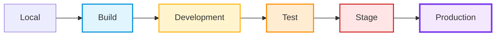

Environment segregation is a fundamental practice in any robust Software Development Lifecycle: Change is promoted through a series of environments, from lower to higher until ultimate deployment into the Production or Live environment. Each environment serves a specific purpose in verifying that the change is correct and will work when it reaches our end users.

Environment segregation and change progression provides multiple benefits:

* **Risk mitigation** - Changes can be tested and validated before reaching production, reducing the likelihood of incidents affecting end users
* **Security and compliance** - Sensitive data can be isolated to production environments, with lower environments using synthetic or anonymised data. Environments can be physically segregated to better support robust access controls.
* **Quality assurance** - Different environments support different activities, from development to formal acceptance testing
* **Parallel workstreams** - Concurrent workstreams can be deployed into ephemeral development environments to verify integration before formal testing

## Core Principles
 
* **Data Segregation** - Personally Identifiable Data (PID) is only allowed in Production. Use synthetic or anonymised data in lower environments
* **Environment Parity** - Keep environments as similar to Production as possible, with similarity increasing as change progresses up through the environments
* **Sequential Progression** - Change must not bypass any environment. Each one acts as a quality gate before moving to the next
* **Single Source of Truth** - Adopt a [branching and release strategy](../../development/dev-git-branching-strategy/) so that it is clear what is a change candidate vs a fully assured release.
* **Immutability** - Replace rather than modify infrastructure and artifacts. Handle differences through configuration, not code
* **Promote artifacts, don't rebuild** - Promote the same binary artifacts through environments rather than rebuilding
* **Infrastructure as Code (IaC)** - Changes to infrastructure should be encapsulated in version controlled code so that they may be tested and released as first class citizens
* **Automation First** - Provision environments, deploy artifacts and run tests within automated pipelines, for repeatability and reliability
* **Least Privilege Access** - Restrict access based on role. Controls become more stringent closer to Production

## Route to Live Environments

We define 6 standard environments along the Route to Live. Propagation of components and infrastructure follows strict sequential order through the environments:

* **Local** - local coding
* **Build** - centralised build and deployment
* **Development** - informal integration
* **Test** - formal test signoff
* **Stage** - formal business signoff
* **Production** - the live environment for end users

### Ephemeral Environments

Delivery teams often work on multiple workstreams at the same time. The restriction of only having a single Development Environment can severely impact the ability to develop the application components, infrastructure and write test scripts. 'Ephemeral environments' are a way to support multiple logical environments within the overall physical environment.

An ephemeral environment is able to be brought up or torn down with a complete set of components according to the needs of the delivery team. For instance, it may contain a single feature branch of one component alongside the production versions of everything else. Or it may contain a suite of many changed components inline with the next full release.

### Release Manifest

Modern solutions often comprise multiple components, each at a specific version. When a change is required, it may impact any number of the constituent parts. It is useful to describe the composition of components per release in a manifest file, declaring which version of each component should be deployed.

## Local

Developers and Testers write and execute code on their own workstations for rapid development, debugging, and verification. SaaS based solutions often provide a user specific development environment that is analogous to a local environment.

Promotion of locally developed changes to higher environments must always be via code commits to the version control system ([Git](../../development/dev-git/)) 

* **Containerisation** - Use [Docker](https://www.docker.com/) to replicate dependencies consistently
* **AWS Cloud emulation** - Use [LocalStack](https://github.com/localstack/localstack) to replicate AWS cloud environments locally
* **Mocks** - Use [Mockoon](https://mockoon.com/) to mock APIs, providing expected behaviour and test assertions
* **Automated setup** - Provide scripts or tooling to automate local environment setup
* **Environment parity** - Maintain similarity with higher environments where practical
* **No real PID** - Never store real personally identifiable data locally

## Build

Continuous integration and deployment activities run within a build environment. A build environment does not replicate the deployment environment, it is used to build and test artifacts independant of the target infrastructure. It is then used to run IaC to manage infrastructure, deploy the built artifacts and promote through the route to live.

CI/CD builds often execute multiple steps, each requiring tools specific to the task. We favour task specific build environments, using containers.

* **Containerisation** - Use [Docker](https://www.docker.com/) to execute build activities, and to replicate dependencies consistently
* **AWS Cloud emulation** - Use [LocalStack](https://github.com/localstack/localstack) to replicate AWS cloud environments within a binary build phase
* **Mocks** - Use [Mockoon](https://mockoon.com/) to mock APIs, providing expected behaviour and test assertions within the binary build phase
* **Build scripts** - Source controlled scripts determine build activities
* **No real PID** - Never store real personally identifiable data locally

## Development

Development is the first, shared deployment environment along the Route to Live. Used by Developers, Testers and Platform Engineers for informal integration testing and Infrastructure as Code validation.

It may support concurrent development through deployment into logically separate, [ephemeral environments](#ephemeral-environments).

* **Integration environment** - Development should integrate multiple components into a complete, working solution similar to Production. External services may be mocked if they are unavailable for development purposes
* **Logical segregation** - Implement namespaces or separate instances to support concurrent workstreams
* **Synthetic data** - Use synthetic test data to support basic functionality

## Test

Official sign-off environment for formal acceptance testing by Testers. Contains the next 'release candidate' versions of solution components.

* **Strict change control** - Only deploy release candidates under direction of Testers. Adhoc deployments into Test can invalidate ongoing test runs.
* **Single version** - Never allow concurrent versions. Test must be baselined against Production. Any updates to Production from a deviated codebase will invalidate prior tests.
* **Synthetic data** - Use synthetic or anonymised test data that reflects defined scenarios with acceptance criteria

## Stage

Final pre-production environment before release, for final validation, business acceptance, and performance testing. Configuration identical to Production with production-like data volumes (anonymised/synthetic). Used by Business stakeholders, Delivery teams, and Platform Engineers for deployment rehearsal.

* **Production parity** - Mirror production infrastructure as closely as possible
* **Security controls** - Implement the same security controls as production
* **Production-scale data** - Use production-like data volumes (anonymised/synthetic)
* **Deployment rehearsal** - Use stage to rehearse deployment and rollback procedures
* **Limited access** - Restrict access to authorised personnel

## Production

The live environment serving end users. Production is the only environment where Personal Identifiable Data is permitted. Highest security controls, strict change control, and availability requirements according to service level agreements. Used by end users, Live Support teams, and Platform Engineers (controlled access).

* **Comprehensive monitoring** - Implement monitoring, alerting, and audit logging
* **Strict access controls** - Follow least privilege principle. Log all access and changes
* **Formal change control** - Follow formal change control processes for all deployments
* **Automated rollback** - Implement automated rollback capabilities
* **Never test in production** - Never test or develop directly in production
* **PID isolation** - Personally Identifiable Data must never leave this environment
* **Disaster recovery** - Implement disaster recovery and business continuity procedures
